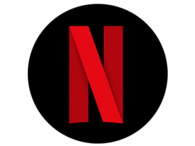
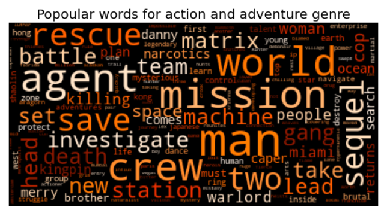
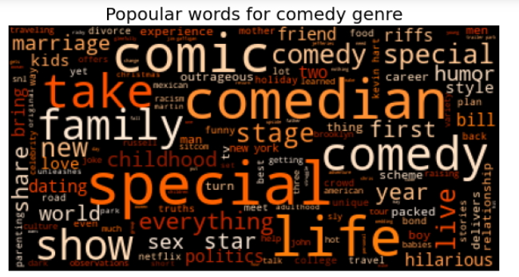
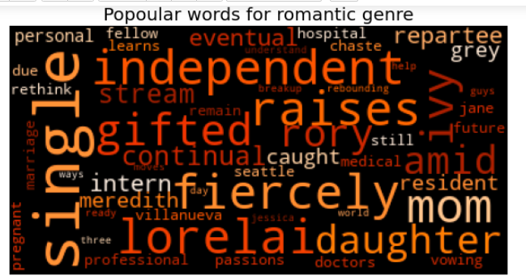
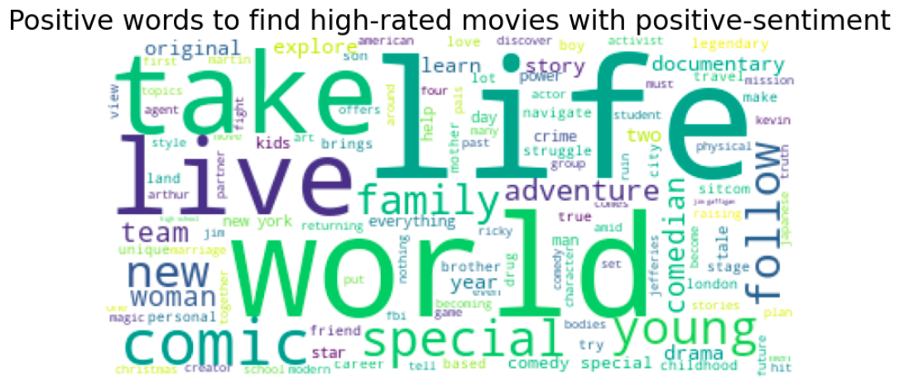

# Popular words and sentiment analysis

For full version of code, click [here]()

After analysis of duration to rating of the movie, as we also have other piece of data that includes information of direcotrs, titles, castings and so on.

Directors play an important role to determine the content standard of the movie. Some audience have preference for specific directors than the others. So I would like to see the popular
directors. As my goal is to find some pattern for high-rated movie, the following popular directors are from the high-rated movie.

Most common 4 director names with High rated movies are:

**1.Shannon Hartman**

**2.Jay Karas**

**3.Lilly Wachowski, Lana Wachowski**

**4.Mike Clattenburg**

Now lets anlayze the description by genres

## Popular words by genres

Netflix also provide the synopsis also called as the description of the movie. From the description, we can see if there is the pattern on how the description is worded. We can see if there are any common words that comes under comedy genre, action and adventure genre, horror genre and romantic genre.

### By Horror Genre

Interestingly there was pattern for horror movies description. So the common words that represented the horror movies were supernatural, terrifying, flashbacks, attack which kind of made sense.

### By Action and Adventure Genre

Similarly, there was a pattern for action and adventure movies on its description on how it was worded. Some of the common words for action, adventure movies were rescue, mission, battle, agent save and so on which also made sense.

### By Comedy Genre

In same way, there was pattern for comedy movies, too. Some common words included in the description of the contents were comedian, special, comedy, family comic and so on.

### By Romantic Genre

In same way, the common words for romantic movies were single, independent, daughter, mom and so on.

Thus, it was kind of clear that there was a pattern on how Netflix worded the description based on the popular genres.

## Some exceptional audiences (Natural Language Processing)

After finding this pattern, it came to my mind that there are some audiences who are only tempted to see the movie which have positive sentiments. Like my aunt, she only watches the movie which gives her positive influence. She reads the description of movie and if the movie description has word like violence (negative vibes), she will ignore that. So lets see if we can find some pattern for these sentiments in the description of netflix contents. To do this I analyzed the sentiment of the description of each netflix content.

I tested if each description of the movie either gives positive, neutral or negative sentiments. Based on the words chose to describe about the content, I would like to make suggestions for people like my aunt on what words does she have to look for while reading the description of the movie so that she could have movie with positive words. It was interesting to find that around 53% of the description of contents gave positive sentiments. 

This means that people like my aunt have option for watching the movie/show according to their choice. After further analysis, I found some common words like live, life, young, comic, adventure, special and family and so on for them that would result for positve sentiment contents.

For futher analysis, where we will we discuss about [Recommendation, Prediction and Classification](Recommendations.md)

   
